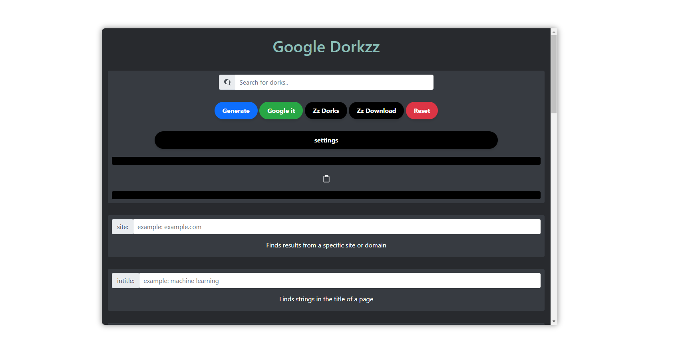

<p align="center">
  <a href="https://github.com/Fareszz1/Google-Dorkzz">
   
  </a>

  <h3 align="center">Google Dorkzz</h3>

  <p align="center">
    "An open-source tool for generating, customizing, and executing advanced Google Dork queries with ease. Perfect for security researchers and penetration testers."
    <br />
    <a href="https://t.me/Fareszz">Telegram</a>
    ·
    <a href="https://github.com/Fareszz1/Google-Dorkzz/issues/1">Issues</a>
    ·
    <a href="https://code.visualstudio.com/">VS Code</a>
  </p>
</p>

## Google Dorkzz



**Google Dorkzz** is a web application designed to simplify the process of generating and searching Google Dork queries. This tool provides an intuitive interface for security researchers, penetration testers, and developers to perform various advanced Google searches (Google Dorking) in a more structured and user-friendly way.

## Try Google Dorkzz
 <a href="https://fareszz1.github.io/Google-Dorkzz/">Click Here</a>

## Features

- 🔍 **Search Bar**: Instantly search through different dork options using the search bar.
- ⚙️ **Google Dork Generation**: Generate custom Google Dork queries for advanced search results.
- 🌐 **Google Search**: Automatically open Google with your custom dork query.
- 🔄 **Reset Button**: Reset all the input fields with a single click.
- 👁️ **Hide Specific Dorks**: Option to hide specific dork input fields for a cleaner interface.
- 📑 **Dork Templates**: Choose from pre-defined Google Dork templates for common use cases like XSS, SQL Injection, File Upload Vulnerabilities, and more.
- 💾 **Download & Upload Settings**: Save your dork settings and target sites for future use, or upload them to quickly set up the application.
- 🎯 **Custom Target Sites**: Save target domains for reusability in different dork queries.

### Built With

- [js](https://www.javascript.com/)
- [html](https://html.com/)
- [CSS3](https://www.w3schools.com/css/)
- [Bootstrap 4.5](https://getbootstrap.com/docs/4.5/getting-started/introduction/)

## Installation

**(You can just use it here)**
<a href="https://fareszz1.github.io/Google-Dorkzz/">Click Here</a>

1. Clone the repository:
   ```bash
   git clone https://github.com/Fareszz1/Google-Dorkzz.git
   ```
    ```bash
   cd google-dorkzz
   ```

2. Open `index.html` in your preferred web browser to launch the application.

3. Ensure you have an active internet connection for Bootstrap and SweetAlert dependencies to load.

## Google Dork Types

The application supports the following dork types:

- `site`: Find results from a specific domain.
- `filetype`: Search for specific file types (e.g., PDF, DOC).
- `intitle`, `allintitle`: Search for strings in the title of a webpage.
- `inurl`, `allinurl`: Find pages with specific strings in the URL.
- `intext`, `allintext`: Search for specific text content on a webpage.
- `before`, `after`: Filter results by date.
- `link`: Find pages that link to a specific URL.
- `related`: Find pages related to a given URL.
- Many more dork types like `inanchor`, `numrange`, `cache`, etc.

## Customization

The app provides customization through:
- **Hide Dork Type**: You can hide certain dork fields to declutter the UI.
- **Save Targets**: Store frequently used domains for future use.

## Google Dork Templates


| Dork Type                           | Google Dork Query Example                                                                                                                                                     | Description                                          |
|-------------------------------------|-------------------------------------------------------------------------------------------------------------------------------------------------------------------------------|------------------------------------------------------|
| XSS Vulnerabilities                 | `inurl:"search.php?q=" OR inurl:"?id=" OR inurl:"view.php?id=" OR inurl:"page.php?id=" intext:"<script>"`                                                                      | Find XSS vulnerabilities in web pages                |
| SQL Injection Vulnerabilities       | `inurl:".php?id=" OR inurl:"/index.php?id=" OR inurl:"?page_id=" intext:"You have an error in your SQL syntax"`                                                                 | Identify SQL injection vulnerabilities               |
| File Upload Pages                   | `inurl:"upload.php" OR inurl:"file_upload.php" OR intext:"upload file" OR inurl:"submit-file"`                                                                                  | Find file upload forms on websites                   |
| "Index of" Listings                 | `intitle:"index of" "parent directory" OR inurl:"/uploads" OR inurl:"/backup" OR inurl:"/files"`                                                                                | Search for directory listings                        |
| Admin Pages (Login Panels)          | `inurl:admin OR inurl:login OR intitle:"admin login"`                                                                                                                           | Locate admin login pages                             |
| Exposed Configuration Files         | `inurl:"config.php" OR inurl:"wp-config.php" OR intext:"DB_PASSWORD"`                                                                                                           | Find exposed configuration files                     |
| Publicly Available Sensitive Files  | `filetype:sql OR filetype:log OR filetype:conf OR filetype:bak OR filetype:old OR filetype:inc "password"`                                                                      | Search for sensitive files exposed publicly          |
| Vulnerable Webcams                  | `inurl:"view/index.shtml" OR inurl:"view/view.shtml" OR intext:"Network Camera"`                                                                                                | Find vulnerable webcams                             |
| PHP Info Pages                      | `inurl:"phpinfo.php" OR inurl:"info.php"`                                                                                                                                      | Locate PHP info pages                                |
| Login Portals with Common CMS       | `inurl:"wp-login.php" OR inurl:"administrator/index.php" OR inurl:"user/login"`                                                                                                 | Find login portals for common CMS systems            |
| File Inclusion Vulnerabilities      | `inurl:"page=" OR inurl:"file=" OR inurl:"document=" intext:"include"`                                                                                                          | Identify file inclusion vulnerabilities              |
| Open FTP Servers                    | `intitle:"index of" inurl:ftp://`                                                                                                                                               | Search for open FTP servers                          |
| Pages Containing Login Portals      | `inurl:login OR inurl:signin OR intitle:"login page"`                                                                                                                           | Find pages with login portals                        |
| Sensitive Directories               | `inurl:/admin OR inurl:/administrator OR inurl:/cpanel OR inurl:/webadmin OR inurl:/portal OR inurl:/userportal`                                                                 | Search for sensitive directories                     |
| PHP Error Messages                  | `intext:"Warning: mysql_connect()" OR intext:"Warning: pg_connect()" OR intext:"Fatal error"`                                                                                   | Locate pages with PHP error messages                 |
| Exposed Documents                   | `filetype:pdf OR filetype:doc OR filetype:xls OR filetype:txt OR filetype:xlsx OR filetype:docx`                                                                                | Find publicly available documents                    |
| WordPress Sensitive Info            | `inurl:wp-config.php OR intext:"DB_PASSWORD" OR intext:"DB_HOST"`                                                                                                               | Search for sensitive WordPress configuration info    |
| Exposed CCTV/Webcams                | `inurl:"/view/view.shtml" OR inurl:"/view/index.shtml" OR inurl:"/liveview.cgi"`                                                                                                | Find publicly exposed CCTV or webcam feeds           |
| Directory Listings without Index    | `intitle:"index of /" OR intitle:"index of" "last modified" OR intitle:"index of" "parent directory"`                                                                            | Search for directories without index pages           |
| Public Backup Files                 | `inurl:"backup" OR inurl:"/bak/" OR inurl:"/backup.zip" OR inurl:"/backup.tar"`                                                                                                 | Find publicly available backup files                 |
| Open MongoDB Instances              | `inurl:"/db/_all_docs" intext:"_id" intext:"_rev"`                                                                                                                              | Identify open MongoDB instances                      |
| Exposed Apache Server Info          | `intitle:"Apache Status" "Server Version" OR "Apache Server Information"`                                                                                                       | Search for exposed Apache server info                |
| Vulnerable .git Folders             | `inurl:".git"`                                                                                                                                                                  | Find exposed `.git` folders                          |
| Default Credentials Pages           | `intext:"default password" OR intext:"default username" OR inurl:"defaultcredentials"`                                                                                           | Locate pages with default credentials                |
| Exposed SSL Certificates            | `filetype:crt OR filetype:pem OR filetype:key OR filetype:csr OR intext:"-----BEGIN CERTIFICATE-----"`                                                                            | Search for exposed SSL certificates                  |
| Public SVN Repositories             | `inurl:"/.svn/" OR inurl:"/svn/" OR inurl:"/.svn/entries"`                                                                                                                       | Find exposed SVN repositories                        |
| Open Database Ports                 | `inurl:3306 OR inurl:1433 OR inurl:5432 OR inurl:1521`                                                                                                                           | Identify open database ports                         |
| Exposed PHP Errors                  | `intext:"PHP Parse error" OR intext:"PHP Warning" OR intext:"PHP Fatal error"`                                                                                                   | Locate exposed PHP error messages                    |
| Public .env Files                   | `inurl:".env" "DB_PASSWORD" "DB_USERNAME"`                                                                                                                                       | Find exposed `.env` files containing sensitive info  |
| Exposed Emails                      | `intext:"@gmail.com" OR intext:"@yahoo.com" OR intext:"@hotmail.com"`                                                                                                            | Search for exposed email addresses                   |
| Public Jenkins Servers              | `intitle:"Dashboard [Jenkins]"`                                                                                                                                                  | Find publicly available Jenkins servers              |
| Exposed GitLab Repositories         | `intitle:"GitLab" inurl:"/explore/projects"`                                                                                                                                     | Locate exposed GitLab repositories                   |
| Exposed Config.json Files           | `inurl:"config.json" intext:"DB_PASSWORD"`                                                                                                                                       | Search for exposed `config.json` files               |
| Public Docker Registries            | `inurl:"/v2/_catalog" OR inurl:"/v2/_layer"`                                                                                                                                     | Find publicly accessible Docker registries           |
| Public Grafana Dashboards           | `inurl:"/dashboard/db" intitle:"Grafana"`                                                                                                                                         | Search for exposed Grafana dashboards                |
| Exposed MySQL Databases             | `intext:"port:3306" intext:"root@localhost"`                                                                                                                                     | Find exposed MySQL databases                         |
| Exposed RDP Ports                   | `inurl:3389 OR intext:"Remote Desktop Protocol"`                                                                                                                                 | Identify exposed Remote Desktop Protocol ports       |
| Public Webmin Instances             | `inurl:"/session_login.cgi" intitle:"Webmin"`                                                                                                                                     | Search for publicly accessible Webmin instances      |
| Exposed CouchDB Instances           | `intext:"Welcome to CouchDB" OR inurl:"/_utils"`                                                                                                                                  | Locate exposed CouchDB instances                     |
| Publicly Accessible Kibana          | `inurl:"/app/kibana"`                                                                                                                                                            | Search for publicly accessible Kibana dashboards     |
| Exposed Wordpress Uploads           | `inurl:"/wp-content/uploads/"`                                                                                                                                                    | Locate exposed WordPress uploads                     |
| Public AWS S3 Buckets               | `inurl:"s3.amazonaws.com" OR inurl:"/s3/"`                                                                                                                                        | Find publicly accessible AWS S3 buckets              |
| Public Jenkins Build Info           | `inurl:"/job/" intitle:"Jenkins" inurl:"/lastBuild/"`                                                                                                                             | Locate public Jenkins build information              |
| Exposed Drupal Installations        | `inurl:"/user/register" intitle:"Register" intext:"Powered by Drupal"`                                                                                                            | Search for exposed Drupal installations              |
| Exposed Magento Admin               | `inurl:"/admin/" intitle:"Magento Admin"`                                                                                                                                         | Find publicly accessible Magento admin panels        |
| Publicly Accessible Elasticsearch   | `intext:"cluster_name" intext:"nodes" inurl:"9200"`                                                                                                                               | Locate exposed Elasticsearch instances               |
| Exposed Microsoft Azure Storage     | `inurl:".blob.core.windows.net"`                                                                                                                                                  | Search for exposed Microsoft Azure storage           |
| Public VNC Servers                  | `inurl:5800 OR inurl:5900 "VNC Authentication"`                                                                                                                                   | Find publicly accessible VNC servers                 |
| Open Telnet Ports                   | `inurl:23 "Telnet" -intitle:"closed"`                                                                                                                                             | Search for open Telnet ports                         |
| Public Jupyter Notebooks            | `inurl:"/lab/workspaces" intitle:"JupyterLab"`                                                                                                                                     | Find publicly accessible Jupyter Notebooks           |
| Exposed FTP Files                   | `inurl:"ftp://" intitle:"index of"`                                                                                                                                               | Locate publicly accessible FTP files                 |
| Exposed Backup Files                | `inurl:"backup" filetype:zip OR filetype:tar OR filetype:gz`                                                                                                                      | Search for exposed backup files                      |
| Exposed Bitcoin Wallets             | `inurl:"wallet.dat" OR inurl:"bitcoin" filetype:dat`                                                                                                                              | Find exposed Bitcoin wallets                         |
| Public Microsoft SharePoint         | `inurl:"/_layouts/15/viewlsts.aspx"`                                                                                                                                               | Locate publicly accessible Microsoft SharePoint      |
| Public PayPal Buttons               | `inurl:"paypal.com/cgi-bin/webscr"`                                                                                                                                               | Search for exposed PayPal payment buttons            |


---

**© 2024 Google Dorkzz. DEV: Fareszz. All rights reserved.**
